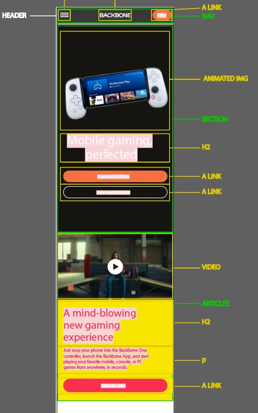
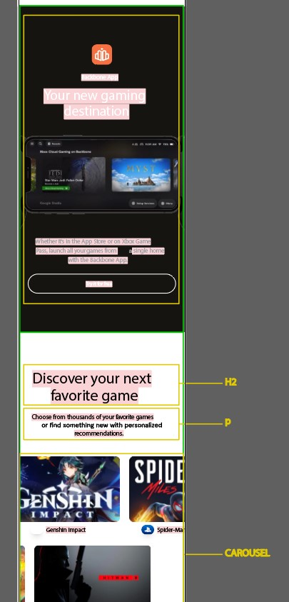

# Procesverslag
Markdown is een simpele manier om HTML te schrijven.  
Markdown cheat cheet: [Hulp bij het schrijven van Markdown](https://github.com/adam-p/markdown-here/wiki/Markdown-Cheatsheet).

Nb. De standaardstructuur en de spartaanse opmaak van de README.md zijn helemaal prima. Het gaat om de inhoud van je procesverslag. Besteedt de tijd voor pracht en praal aan je website.

Nb. Door *open* toe te voegen aan een *details* element kun je deze standaard open zetten. Fijn om dat steeds voor de relevante stuk(ken) te doen.

## Jij

  
uitwerken voor kick-off werkgroep

  ### Auteur:
  Lisa Fokkinga

  #### Je startniveau:
  Rood

  #### Je focus:
  Mijn focus ligt vooral op de surface laag, maar ik zou toch nog graag aandacht besteden aan de responsiveness
 

## Je website

  
uitwerken voor kick-off werkgroep

  ### Je opdracht:
  https://playbackbone.com/

  #### Screenshot(s) van de eerste pagina (small screen): 
  Backbone playstation edition pagina  
  

  #### Screenshot(s) van de tweede pagina (small screen):
  Backbone webshop
  
 

## Toegankelijkheidstest 1/2 (week 1)

  
uitwerken na test in 1e werkgroep

  ### Bevindingen
  Lijst met je bevindingen die in de test naar voren kwamen:

  #### Screenreader
  Hier korte omschrijving (met indien nodig afbeeldingen):

  Bij de screenreader krijg je een korte omvatting van afbeeldingen, die niet voldoen aan wat er in werkelijk
  werd getoond in deze afbeeldingen. Gebruikers kunnen hierdoor dus de afbeelding anders begrijpen.
  De tweede bevindeng is bij een carousel, als je bijvoorbeeld klinkt op 1 van de afbeeldingen in het carousel word deze uitgesproken. Dit zou als fijn ervaart kunnen worden, maar eventueel zou ook de hele reeks afgespeeld kunnen worden. De laatste bevinding had ik ondervonden bij de indeling van de mobiele website die veranderde door voice-over. Hiermee werd de 'features lijst' halverwege gesplitst.

  Hier een omschrijving van hoe het opgelost kan worden (met indien nodig afbeeldingen)
  De volgende punten kunnen worden opgelost door simpelweg afbeeldingen een beter alt tekst te geven, die beter passen bij de
  weergeven afbeeldingen. De carousel alle afbeeldingen af te spreken en om een betere indeling voor de feature lijst toe te 
  passen, zodat deze niet halverwege worden gesplitst.

  #### Muis en Toetsenbord 
  Hier korte omschrijving (met indien nodig afbeeldingen):
  De grootste bevinding is dat de website niet funcioneert met toetsenbord functies, zoals tab en pijltjes. Elementen en knoppen worden overgeslagen, navigatie tabs worden geselecteerd maar niet uitgeklapt, dus je weet niet welke er geselecteerd is.

  Hier een omschrijving van hoe het opgelost kan worden (met indien nodig afbeeldingen)
  Dit site laten functioneren met tabs en toetsenbord control. zodat er logisch getabt kan worden door de site heen. Navigatie word bij selectatie uitgeklapt, zodat de gebruiker weet waar hij/zij is.

  #### Motoriek (shocks, elastiekjes)
  Hier korte omschrijving (met indien nodig afbeeldingen)
  Bij het testen van de website en mobiele website met motoriek beperkingen, viel op dat het gebruik van toetsenbord handig is om snel door de site heen te komen zoals met de pijltjes scrollen. In het geval van de mobiele website is het wat lastiger om met elastiekjes door te kunnen scrollen

  <b>Hier een omschrijving van hoe het opgelost kan worden (met indien nodig afbeeldingen)<b>
  Het focus punt van het bestellen mag groter en duidelijker weergegeven worden. Door de motorieke beperkingen is het van belang dat knoppen 
  wat groter zijn. andere elementen zoals swipe buttons met pijltjes ook groter kunnen.

  #### Visueel (brillen, contrast, kleurenblind, dark/light). 
  Hier korte omschrijving (met indien nodig afbeeldingen)
  Bij het testen van de website en mobiele website met een visuele beperking is het lastig om kleine letters te kunnen lezen. Of lage contrasten te kunnen constanteren. Bij de website zelf is geen verschil tussen dark/light modus, de vraag alleen is of dit echt nodig is. 

  Hier een omschrijving van hoe het opgelost kan worden (met indien nodig afbeeldingen)
  Vooral bij de website de contrasten groot genoeg houden. Kopjes zijn gelukkig al best wel groot dus dat zeker behouden.

## Breakdownschets (week 1)

  
uitwerken na afloop 2e werkgroep

  ### de hele pagina: 
    
  
  

  ### dynamisch deel (bijv menu): 
  

## Voortgang 1 (week 2)

  
uitwerken voor 1e voortgang

  ### Stand van zaken
  Ik ben nog niet heel ver gekomen met mijn website, omdat ik nog bezig ben met de breakdown en
  hoe ik dit graag zou willen indelen. Zodat ik daarna snel van slag kan om alles in elkaar te zetten.

  ### Agenda voor meeting
  samen met je groepje opstellen

  Bente heeft verschilende vragen voor haar website, daarom hebben wij als groepje gekozen dat
  zij dan als eerst aan de beurt is. Daarna is Ryan die ook wat vraagjes heeft. Tijn en ik willen graag wat feedback over ons huidig werk.

  ### Verslag van meeting
  hier na afloop snel de uitkomsten van de meeting vastleggen

  - De section kunnen een aria label krijgen als het een thema/onderwerp heeft.
  - Het gebruiken van positions zijn nu duidelijk.
  - Ik hoef nog geen zorgen te maken over het gebruiken van een grid of flex. Gewoon
  beginnen en dan bekijken. 

## Voortgang 2 (week 3)

  
uitwerken voor 2e voortgang

  ### Stand van zaken
  voor het tweede gesprek sta ik goed in mijn schoenen wat betreft mijn website. Ik heb een grote sprong gemaakt sinds vorig voortganggesprek. Zo ben ik al begonnen met het implenmeteren van animaties en dergelijke. Ik heb toch een aantal vraagjes
  wat betreft mijn vraagjes. 

  ### Agenda voor meeting
  samen met je groepje opstellen

  - Bente heeft niet heel veel vragen, wil het liefst eigenlijk feedback over haar gemaakte werk. 
  - Ryan heeft ook graag dingen die hij wilt laten zien als voortgang. 
  - Tijn heeft ook vragen over zijn werk 

  ### Verslag van meeting
  hier na afloop snel de uitkomsten van de meeting vastleggen

  - Ik heb gevraagd of de studentassisten naar mijn code konden kijken en of
  ik dit goed deed. (semantisch correct). Daarnaast was een andere vraag of ik 
  divjes mocht gebruiken alleen voor het stijlen en na ook de docent te hebben gesproken was dit mogelijk.
  - Op mijn vragen had ik in iedergeval goede antwoorden gekregen waarmee ik verder
  kon

## Toegankelijkheidstest 2/2 (week 4)

  
uitwerken na test in 8e werkgroep

  ### Bevindingen
  Lijst met je bevindingen die in de test naar voren kwamen (geef ook aan wat er verbeterd is):

  #### Screenreader
  De screenreader op mijn computer doet het een beetje vaag, hij leest het niet helemaal op de juiste manier voor. Ik ben aan het twijfelen of het door windows komt? Ik heb nog niet echt goede resultaten uit de test kunnen halen. Ook sommige knoppen leest hij niet voor of kan hij het niet goed uitspreken omdat dit engels is.

  #### Muis en Toetsenbord 
  Bij de muis en toetsenbord hadden ik en Eefje ondervonden tijdens het testen dat nog niet alles goed werkte met de tabjes en de pijltjes. 

  #### Motoriek (shocks, elastiekjes)
  bij de motoriek testeb kwamen positieve feedback uit, de knoppen die waren gebruikt bij mijn ontwerp waren grote knoppen. dit maakte het makkelijker voor Eefje om toch te kunnen klinken op de verschillende buttons. 

  #### Visueel (brillen, contrast, kleurenblind, dark/light). 
  Bij de visuele testen kwamen er verder ook geen verrassende resulaten. Ook weer door de grote knoppen was het makkelijk te komen op hetgene waar Eefje wou zijn. De contrasten waren ook duidelijk genoeg om niet in de verwarring te komen en kon met de brillen nog steeds alles goed zien.

  #### Waar moet ik mijn aandacht nog even insteken?
  Bij de screenreader en de muis en toetsenbord testen kan ik nog veel veranderen waardoor mijn gemaakte website beter is dan de andere. Ik heb een paar ideeen hoe dit al een stuk beter kan en die neem ik daarom ook mee naar het volgende voortgangsgesprek.

## Voortgang 3 (week 4)

  
uitwerken voor 3e voortgang

  ### Stand van zaken
  Ook deze week was ik goed bezig, ik had al een begin van de tweede website en mijn eerste pagina was al bijna zo goed als af. Ik ben nog even gaan kijken naar reponsiveness van de website maar dat bleek toch een beetje lastig te zijn. Toch komt het vaker voor dat er ineens foutjes blijken te zijn, die probeer ik zo goed mogelijk op te lossen.

  ### Agenda voor meeting

  - Met zijn alle willen we nog onze laatst werk zien er zijn van te voren nog geen concrete vragen

  ### Verslag van meeting
  Eerst hadden we nog niet echt vragen of dingen waar we het graag over zouden hebben. Totdat mij te binnenschiet over
  de toegankelijkheid van mijn website. Hierin laat de docent heel erg makkelijke trucs zien hoe ik bijvoorbeeld een
  skip link kan maken, hoe attributen werken en ook hoe je nou zo'n nav kan uitklappen. Met deze handige tricks kunnen we
  nu allemaal aan de slag.

## Eindgesprek (week 5)

  
uitwerken voor eindgesprek

  ### Je uitkomst - karakteristiek screenshots:
  Pagina 1:
  

  Pagina 2:
  

  ### Dit ging goed/Heb ik geleerd: 
  Wat vooral bij mij goed gingen waren de animatie's daar was ik ook heel trots op.

  
  

  ### Dit was lastig/Is niet gelukt:
  Ik heb niet perse iets waarvan ik denk nou dat is lelijk of niet goed gelukt. Ik had wel dingen die
  wat lastiger gingen dan verwacht.

  
  

## Bronnenlijst

  
continu bijhouden terwijl je werkt

  Nb. Wees specifiek ('css-tricks' als bron is bijv. niet specifiek genoeg).

  1. https://www.youtube.com/watch?v=UTHgr6NLeEw | Make Awesome SVG Animations with CSS
  2. https://codepen.io/mayurbirle/pen/NvXKPq?editors=1100 | De responsive CSS3 Slider
  3. https://codepen.io/stephenpaton-tech/full/JjRvGmY | Custom scrollbar maker
  4. https://html-css-js.com/css/generator/box-shadow/ | shadow generator CSS
  5. https://svgartista.net/ | SVG Animation CSS

